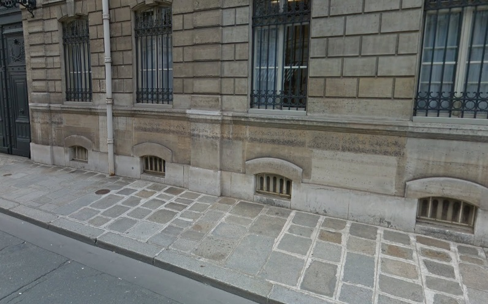

# CTF OSINT - Chien perdu

## Présentation du CTF 
**ID** 46 dans **les CTFs de Cyrhades**

Je vous explique, j'étais dans la rue quand j'ai vu un jeune chien, pas plus de 2ans à mon avis,s'enfuir du bâtiment derrière moi, je n'ai même pas eu le temps de le prendre en photo. Mais j'aimerais savoir à qui il appartient et comment il s'appelle.

Vous devez trouver le prénom et le nom du propriétaire et le nom de ce jeune chien.

# Format du Flag
Exemple avec les données suivantes : 
   - prénom du propriétaire : michel
   - nom du propriétaire : durand
   - nom du chien : clementine

Flag : michel_durand_clementine

## Aperçu

-----------

## Installation manuel
Vous n'utilisez pas l'application **les CTFs de Cyrhades** ? C'est dommage !
Mais voici comment installer ce CTF manuellement :

> git clone https://github.com/Hack-Oeil/OSINT_CHIEN_PERDU.git

> cd OSINT_CHIEN_PERDU
